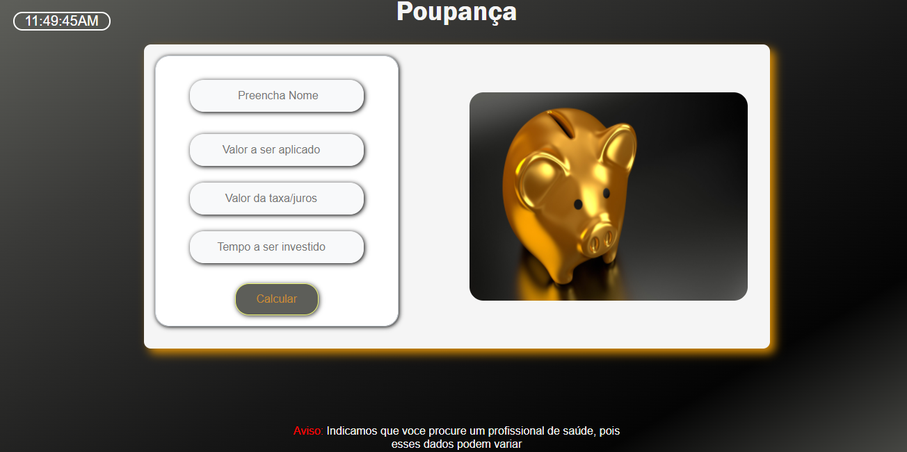

# calculadora_poupanca
Calcula a poupança de um determinado individuo ao ser apresentado o dados como valor, juros, e tempo. 

Imagem clicavel e representativa da aplicação:

 <HTML>
  <body>
    
  <body>
 <HTML>
